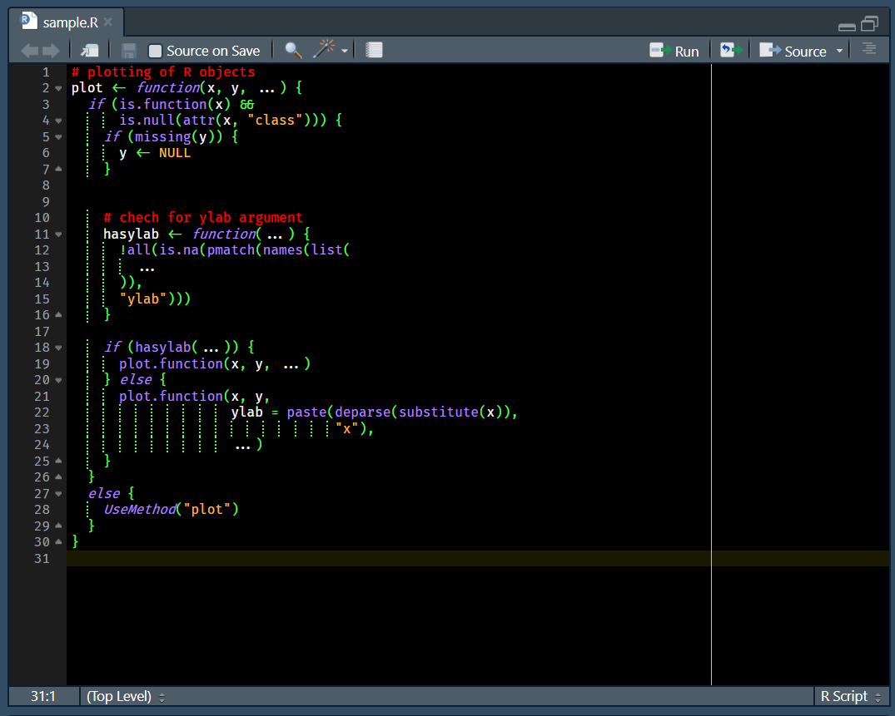

# **RStudio EvangelionUnit01 theme** 

EvangelionUnit01 color theme for RStudio.

## Overview

This repo contains RStudio theme file that make your RStudio editor EvangelionUnit01 color theme.

From Rstudio version 1.2, you can create your own custom themes without having to overwrite an existing one. Check out the [RStudio IDE Custom Theme Support](https://blog.rstudio.com/2018/10/29/rstudio-ide-custom-theme-support/)  for an instruction.

## Feature & Image

### Syntax highlighting in RStudio



Sample code is using [Fira Code Retina](https://github.com/tonsky/FiraCode)

## Requirement


RStudio 1.2.x or higher

## Installation

### 1. Installation via RStudio

- If you have RStudio >=v1.2, you can directly import the .rstheme file into RStudio settings.

   See [RStudio IDE Custom Theme Support](https://blog.rstudio.com/2018/10/29/rstudio-ide-custom-theme-support/) for a pictorial step-by-step, or creating custom themes for RStudio if you want to learn more.

- To download and apply the theme, run the following code in RStudio.

```R
rstudioapi::addTheme("https://raw.githubusercontent.com/takemal-studio/RStudio_Evangelion_Unit01_theme/master/EvangelionUnit01.rstheme", apply = TRUE)

# To install, but not apply the theme, just switch the apply argument to FALSE.
```

### 2. Manual Installation & Changing Theme

- If you switch the apply argument to FALSE or the steps above don't work, you can manually download the `EvangelionUnit01.rstheme` file and place it in `.R/rstudio/themes` in your R home directory.

- To change your current theme, select the theme by going to `Tools > Global Options > Appearance > Editor theme`

## Recommended RStudio settings for EvangelionUnit01 theme

- Enable: `Tools -> Global Options -> Code -> Display -> Highlight selected line`
- Enable: `Tools -> Global Options -> Code -> Display -> Show margin (Marzin column [80])`
- Enable: `Tools -> Global Options -> Code -> Display -> Show indent Guides`
- Enable: `Tools -> Global Options -> Code -> Display -> Show syntax highlighting in console input`
- Enable: `Tools -> Global Options -> Code -> Display -> Highlight R function calls`

## Uninstallation

To uninstall (removing from the list of available themes) EvangelionUnit01 theme, execute the following code:

```R
rstudioapi::removeTheme("EvangelionUnit01")
```

or delete `EvangelionUnit01.rstheme` file from `.R/rstudio/themes` in your R home directory.

## Supported Platforms

EvangelionUnit01 theme has only been tested on **Windows**. Feedback from other platforms welcome.

## Author

takemal-studio

## License

- MIT
  - see LICENSE
